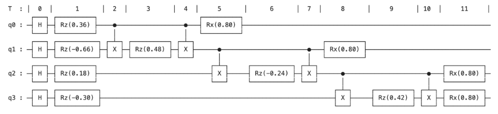
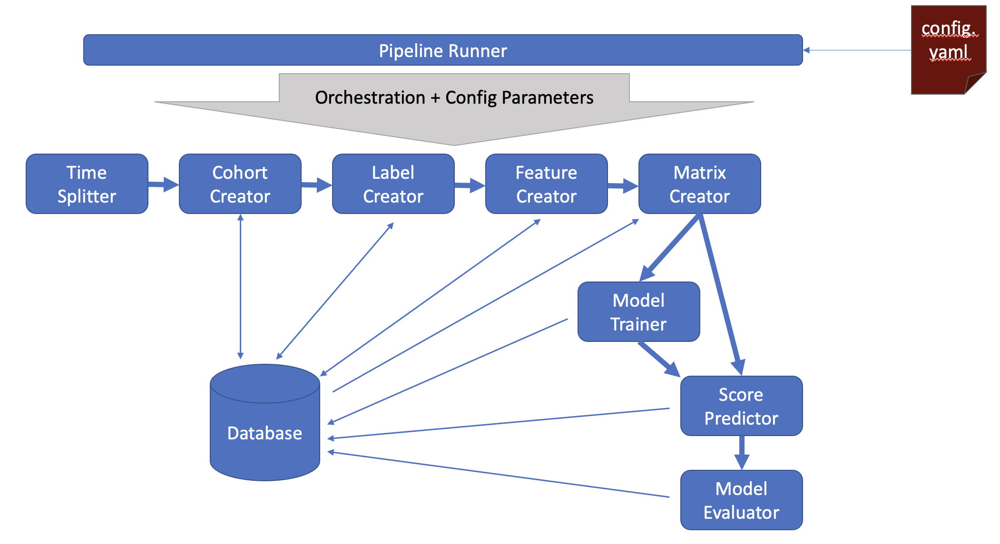
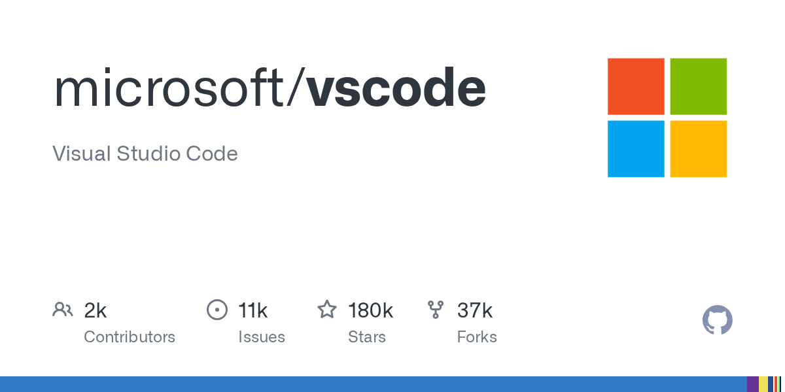

# Selected Projects

## 2026

    

        
    

    

        <h3 class="publication-title">
            <a href="/ColorNamingGame" class="publication-link">
                Emergence of Basic Color Terms via the Naming Game
            </a>
        </h3>
        
Computational Linguistics Project

        
Ryan Wang

        
2026

        

            Agent-Based Modeling
            Cognitive Science
            Linguistics
            Simulation
        

    

## 2025

    

        
    

    

        <h3 class="publication-title">
            <a href="/AgentBreeder" class="publication-link">
                A Gate-Based Quantum Approach to Optimal University Course Scheduling
            </a>
        </h3>
        
Course Project – Carnegie Mellon University

        
Ryan Wang, Erika Ramirez, Nick Pinon

        
2025

        

            QUBO
            <a href="assets/QUBO_paper.pdf" class="tag tag-arxiv">PAPER</a>
            <a href="https://github.com/ryan-twang/cmu-course-schedule-qubo" class="tag tag-github">GITHUB</a>
        

    

    

        
    

    

        <h3 class="publication-title">
            Predicting Legislative Bill Passage Using Machine Learning
        </h3>
        

            ML Policy Lab — Data Science for Social Good (ACPA)
        

        

            Ryan Wang, Karen Gonzalez, Luke Nalewajk
        

        
2025

        

            Data Science
            Machine Learning
            <a href="assets/mlppl_report.pdf" class="tag tag-arxiv">PAPER</a>
            <a href="https://github.com/dssg/mlpolicylab_fall25_bills3" class="tag tag-github">
                GITHUB
            </a>
        

    

  

    
  

  

    <h3 class="publication-title">
      Open Source Contributions to Visual Studio Code
    </h3>

    

      Microsoft VS Code — Open Source Contributions
    

    

      Ryan Wang
    

    
2025

    

      Software Engineering
      Open Source
      <a href="https://github.com/ryan-twang/vscode_git_push_-_pray" class="tag tag-github">
        GITHUB
      </a>
    

    

      Implemented and documented improvements to Git workflows in VS Code, including repository filtering and ranking for the Git: Clone command, and enhancements to multi-cursor behavior using regex-based selection.
    

    <ul class="publication-bullets">
      <li>Task 1: GitHub Clone Filtering + Ranking Feature (#141754)</li>
      <li>Task 2: Regex Multi-Cursor Enhancement (#107090)</li>
    </ul>
  

